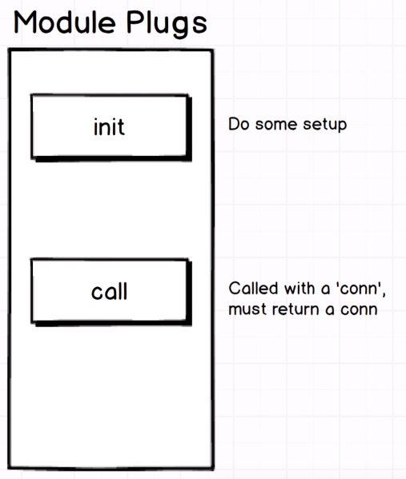
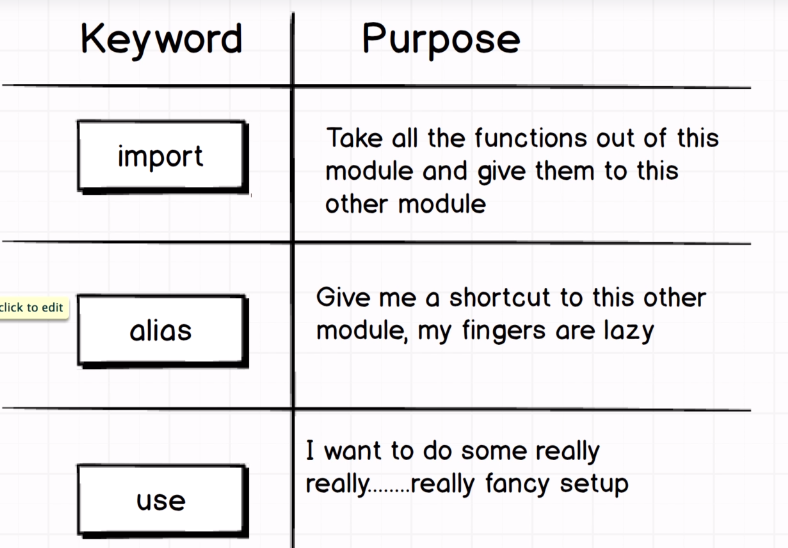
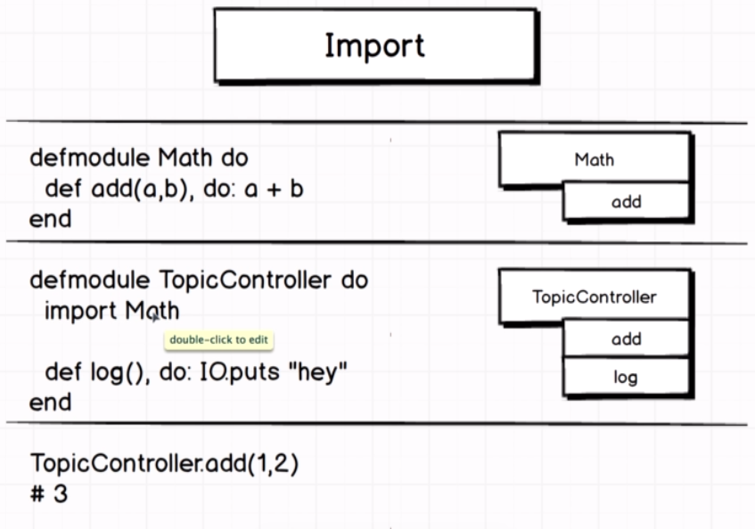
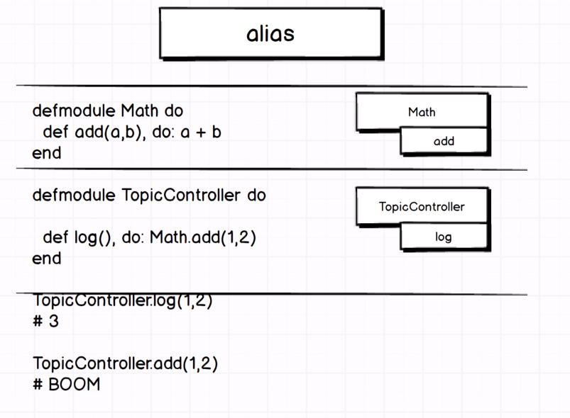
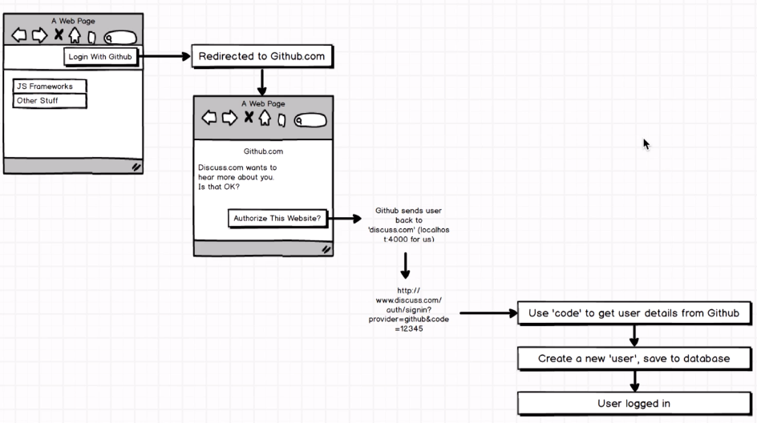
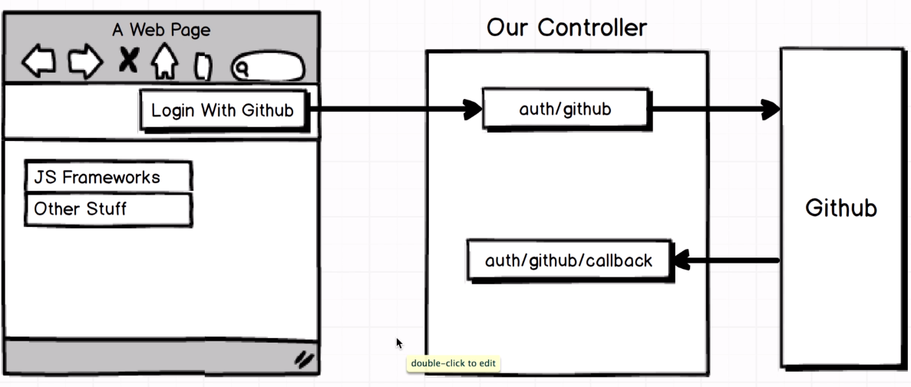

# The Complete Elixir and Phoenix Bootcamp

This repository is to save the projects carried out during the elixir course at Udemy.

## How to implement plugs

  

## Differences between

  

### Example import

  

### Example alias

  

## Redirect Github

  

## Router for auth

  

