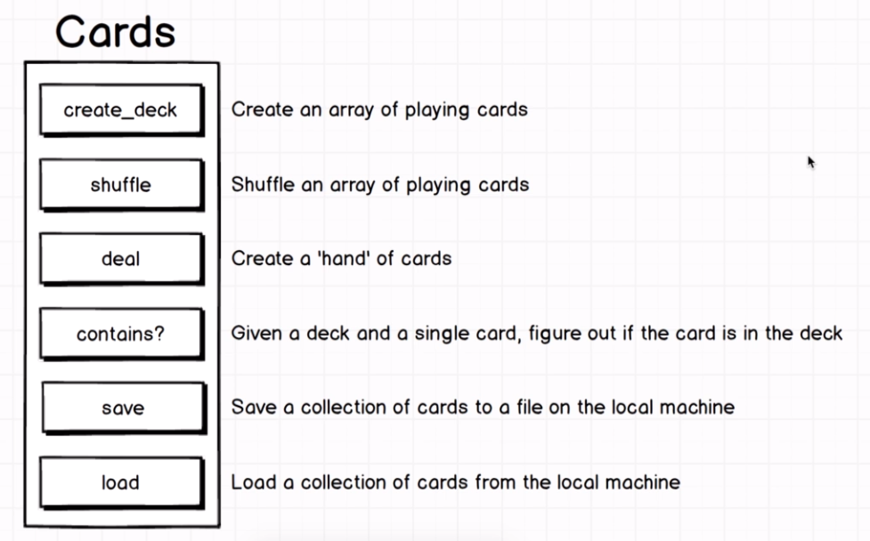
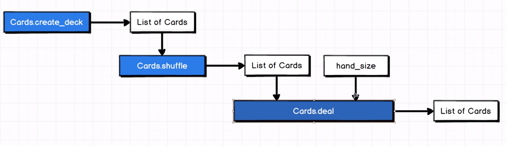

# Cards

A program that's going to simulate creating and dealing a hand of playing cards like for poker, blackjack or go fish or whatever card game you might play. Not go creating an entire specific gambling game. Is implementing common operations found with handling a deck of cards. Since projects not going to have a UI, we're just going to be operating or implementing these to be ran from the command line.

The methods implemented are:

<p align="center">
  
</p>

Example flow:

<p align="center">
  
</p>

## Installation

If [available in Hex](https://hex.pm/docs/publish), the package can be installed
by adding `cards` to your list of dependencies in `mix.exs`:

```elixir
def deps do
  [
    {:cards, "~> 0.1.0"}
  ]
end
```

Documentation can be generated with [ExDoc](https://github.com/elixir-lang/ex_doc)
and published on [HexDocs](https://hexdocs.pm). Once published, the docs can
be found at [https://hexdocs.pm/cards](https://hexdocs.pm/cards).

### Mix docs and doctests

```elixir
def deps do
  [
    {:ex_doc, "~> 0.24"}
  ]
end
```

```elixir
mix docs
```

