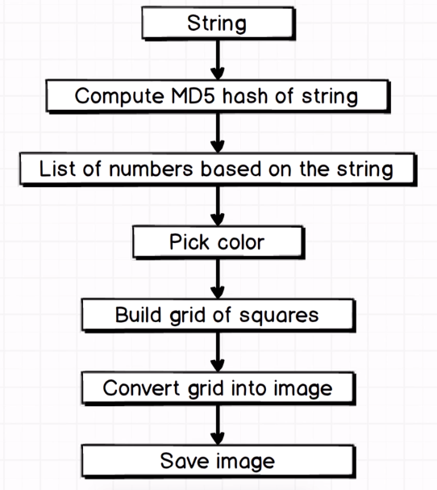

# Identicon

An Identicon is a visual representation of a hash value, usually of an IP address, that serves to identify a user of a computer system as a form of avatar while protecting the user's privacy.

The identicon will take a string as input and will generate an image:

<p align="center">
  
</p>

Some examples:

<p align="center">
  
</p>

Image is 250px by 250px, with 5X5 grid of squares, each 50px tall and wide:

<p align="center">
  
</p>

Steps for generate an image:

<p align="center">
  
</p>

Distribution of values of array at image pixels:

<p align="center">
  
</p>

Calculate to paint pixels:

<p align="center">
  
</p>

Generate the image:

<p align="center">
  
</p>

## Installation

If [available in Hex](https://hex.pm/docs/publish), the package can be installed
by adding `identicon` to your list of dependencies in `mix.exs`:

```elixir
def deps do
  [
    {:identicon, "~> 0.1.0"}
  ]
end
```

Documentation can be generated with [ExDoc](https://github.com/elixir-lang/ex_doc)
and published on [HexDocs](https://hexdocs.pm). Once published, the docs can
be found at [https://hexdocs.pm/identicon](https://hexdocs.pm/identicon).

